# User Manual - BUPT Teaching Assistant Recruitment System

## 1. Purpose

The BUPT Teaching Assistant Recruitment System is a role-based web application for managing Teaching Assistant recruitment. It supports three user roles:

- **TA**: maintains a profile, uploads a CV, searches for jobs, applies to postings, tracks applications, receives messages, and books interview slots.
- **MO**: posts jobs for assigned modules, reviews applicants, sends interview notices, evaluates candidates, manages decisions, and monitors interview schedules.
- **Admin**: manages workload policies, system monitoring, user records, MO module assignments, email settings, and AI API settings.

## 2. Access URL and Runtime

After starting the application locally, open:

```text
http://localhost:8080/ta-recruitment/
```

Recommended Windows startup:

```powershell
.\run.cmd
```

For optional LLM features, copy `ai.env.example` to `ai.env` and set an OpenAI-compatible API key before running `run.cmd` or `run-with-ai.ps1`.

Alternative Maven Wrapper startup:

```powershell
.\mvnw.cmd package cargo:run
```

The application stores runtime data in JSON files under the local `data/` directory unless a custom data directory is configured.

## 3. Demo Accounts

| Role  | Username | Password   | Notes                          |
| ----- | -------- | ---------- | ------------------------------ |
| TA    | `ta1`    | `ta123`    | Standard TA applicant          |
| TA    | `ta2`    | `ta123`    | Standard TA applicant          |
| TA    | `ta5`    | `ta123`    | Workload conflict demo account |
| TA    | `ta6`    | `ta123`    | Workload overload demo account |
| MO    | `mo1`    | `mo123`    | Module organiser               |
| Admin | `admin`  | `admin123` | System administrator           |

## 4. Login, Registration, and Password Reset

### 4.1 Login

1. Open the system URL.
2. Enter username and password.
3. Optionally select **Remember me** to stay signed in on the device.
4. Click **Login**.

The system redirects users to the correct portal based on role:

- TA -> TA Home
- MO -> My Jobs
- Admin -> Recruitment Summary

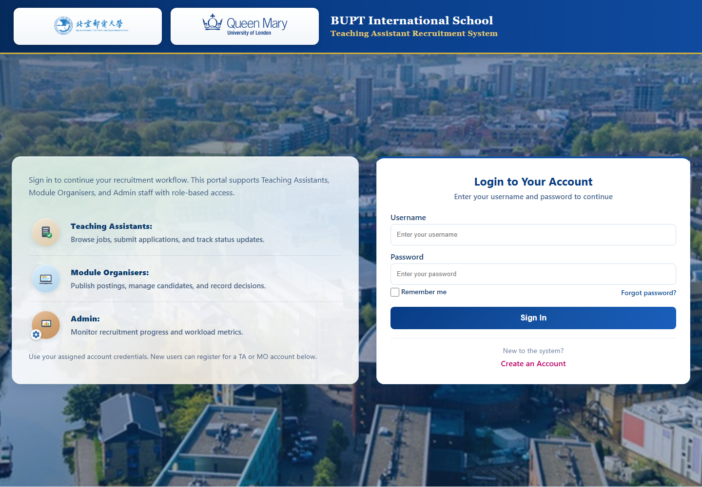

### 4.2 Registration

Users can create a new **TA** or **MO** account from the registration page. The form collects:

- Username
- Real name
- Email
- Password
- Role

If email verification is enabled by Admin and SMTP is configured, an email verification code is required.

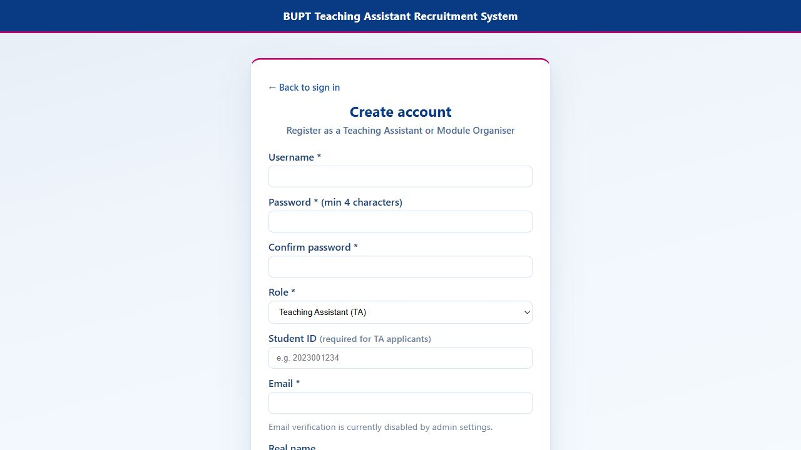

### 4.3 Forgot Password

Password reset is available only when email delivery is enabled and configured. The user enters their email address, receives a verification code, and sets a new password.

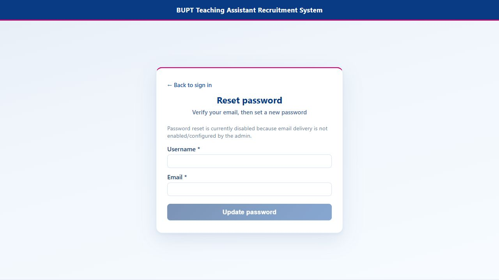

## 5. TA Portal

The TA sidebar includes:

- **Home**
- **Find Jobs**
- **Saved Jobs**
- **My Applications**
- **Messages**
- **My Profile**

### 5.1 TA Home

The TA Home page provides a quick overview of profile readiness and application activity. It also shows shortcuts to important TA workflows.

Typical checks include:

- Contact email on file
- Skills listed
- CV uploaded
- Academic details completed

### 5.2 My Profile

The TA profile is used by MOs and matching features when applications are reviewed.

Profile fields include:

- Student ID
- Contact email
- Phone
- Degree
- Programme
- Year of study
- Skills
- Availability
- Introduction
- Previous TA or teaching experience
- CV upload

To update the profile:

1. Open **My Profile**.
2. Fill in or edit the profile fields.
3. Upload a CV if needed.
4. Click the save/update button.

Supported CV-related behavior:

- CV files can be previewed or downloaded by authorized users.
- If AI is configured, the system can use CV text extraction to help pre-fill profile fields.
- If AI is not configured, the profile still works normally.

> **Screenshot placeholder: TA profile form**
> 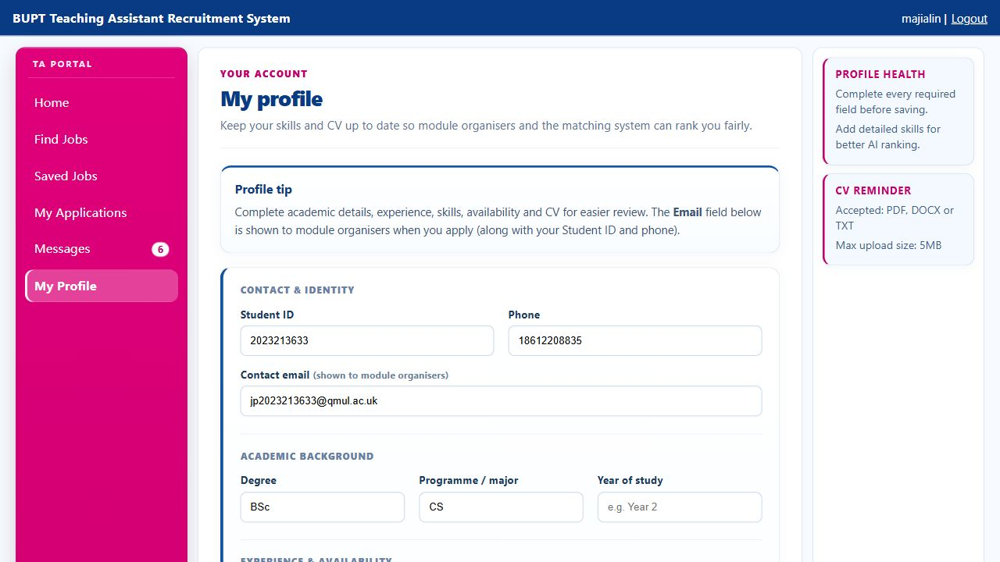

### 5.3 Find Jobs

The **Find Jobs** page lists open postings. TAs can filter or search by:

- Keyword
- Module code
- Skill
- Job type

Each job card shows key information such as module, title, job type, required skills, and match information.

To review a job:

1. Open **Find Jobs**.
2. Use filters if needed.
3. Click **View details** or the equivalent job detail action.

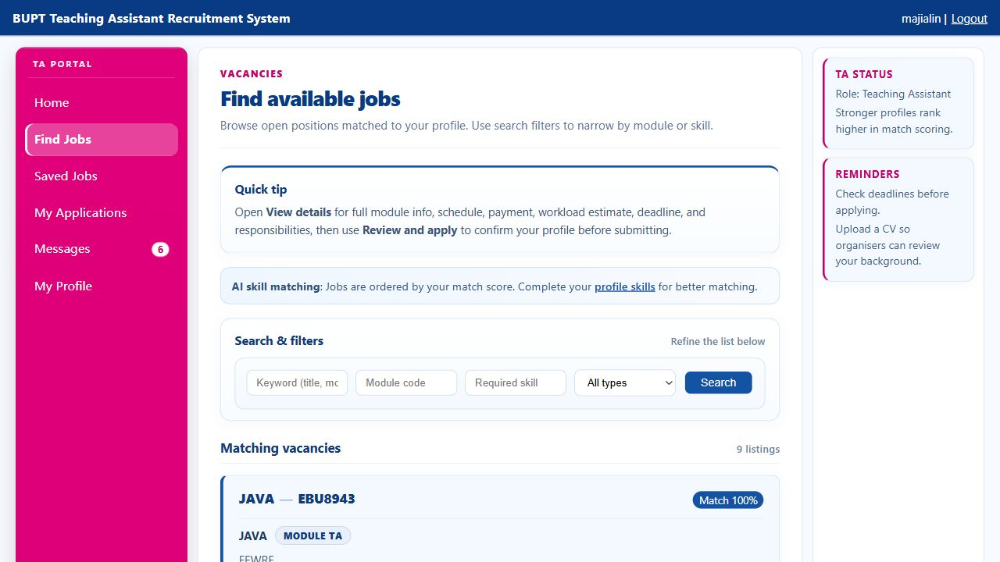

### 5.4 Job Detail and AI Match Insight

The job detail page shows:

- Job title and module
- Work arrangements
- Key information
- Responsibilities
- Course milestones
- Interview preview
- Workload estimate
- Application action

If AI features are enabled, the page may show a **Generate AI insight** button. This produces an on-demand match explanation for the current TA and job. The system does not require AI for normal job browsing or application.


### 5.5 Apply for a Job

To apply:

1. Open a job detail page.
2. Review job information, workload, interview preview, and required skills.
3. Click the apply/review action.
4. Confirm the application on the confirmation page.

The system prevents duplicate applications for the same job. It can also block applications if the Admin workload-hour cap would be exceeded.

### 5.6 Saved Jobs

TAs can save jobs for later review. The **Saved Jobs** page lists saved postings and allows TAs to reopen job details.
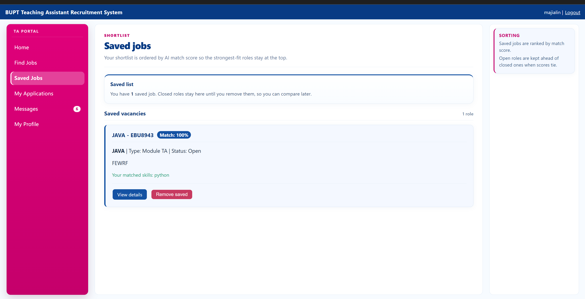


### 5.7 My Applications

The **My Applications** page tracks submitted applications. Application statuses include:

- `PENDING`
- `INTERVIEW`
- `WAITLIST`
- `SELECTED`
- `REJECTED`
- `WITHDRAWN`
- `AUTO_CLOSED`

The page also shows interview notices, application timelines, and available actions.

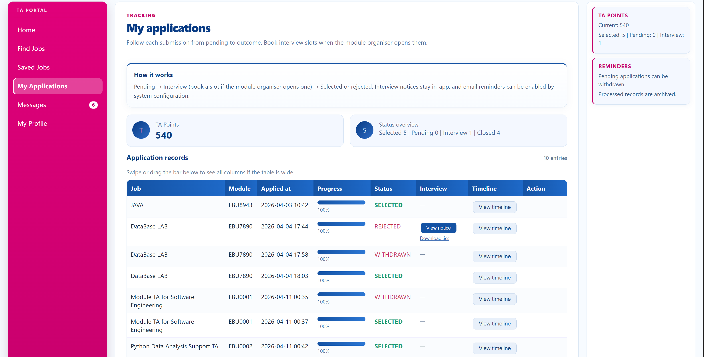

### 5.8 Interview Booking

When an MO opens interview slots for an application, a TA can book or change an interview slot.

To book a slot:

1. Open **My Applications**.
2. Find an application in the interview or waitlist stage.
3. Open the booking page.
4. Select an available slot.
5. Submit the booking.

The current booking shows time and location.

### 5.9 Messages

The **Messages** page displays in-app notifications related to application events, such as:

- Application submitted
- Interview invitation
- Interview details updated
- Waitlist update
- Selection result
- Rejection result
- Auto-closed pending application

Unread messages may appear as a badge in the TA sidebar.
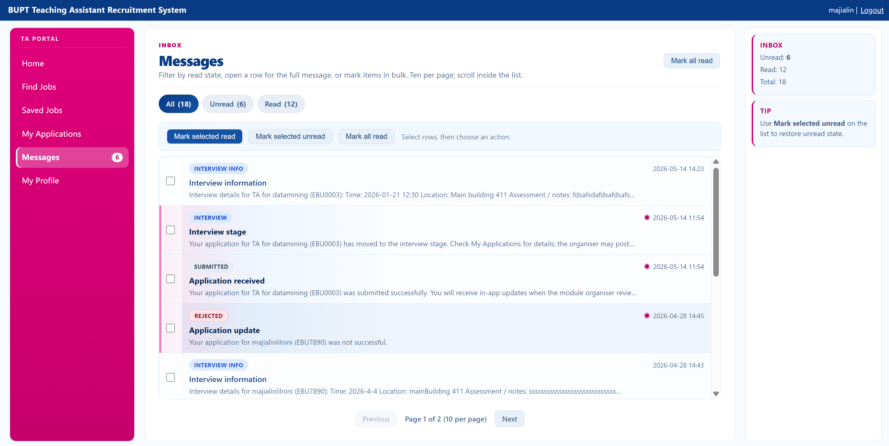

## 6. MO Portal

The MO sidebar includes:

- **My Jobs**
- **Post Job**
- **Past postings**
- **Interview calendar**

### 6.1 Assigned Modules

MOs can only post jobs for modules assigned by Admin. Assigned modules are shown in the MO portal.

If no modules are assigned, the MO must ask Admin to assign modules first.

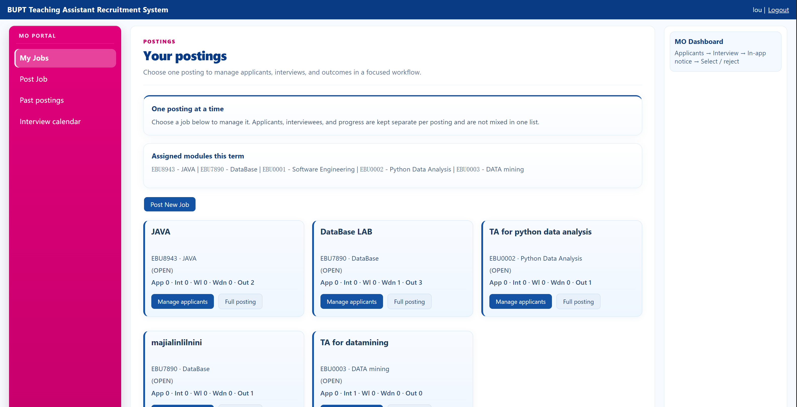> 

### 6.2 Post Job

The **Post Job** page creates a new posting for an Admin-assigned module.

Main sections:

- Basic information
- Work arrangements
- Recruitment setup
- Submit

Basic information includes:

- Assigned module selector
- Job title
- Module code
- Module name
- Job type
- Description
- Responsibilities

Work arrangements include structured rows:

- Work name
- Per-session duration in hours
- Number of sessions
- Number of TAs
- Optional specific day/time

Recruitment setup includes:

- Course timeline and exam milestones
- Estimated interview date
- Estimated interview start time
- Estimated interview end time
- Interview location
- Payment amount
- Payment currency
- Payment rate type
- Application deadline
- Required skills
- Maximum applicants
- Auto-fill from waitlist option
- Template saving option

Structured input rules:

- Per-session duration must be numeric hours.
- Estimated interview time uses date, start time, and end time fields.
- Payment uses amount, currency, and rate type fields.
- Application deadline must be a valid date and cannot be in the past.
- The module must match an Admin-assigned module.
  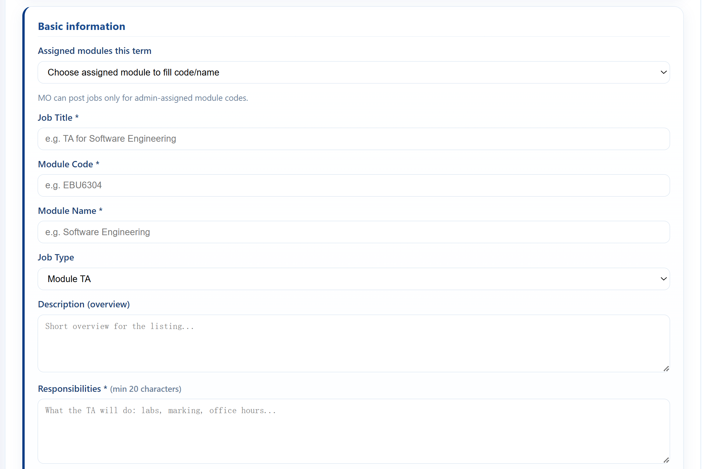
  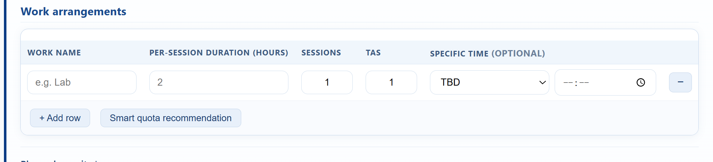
  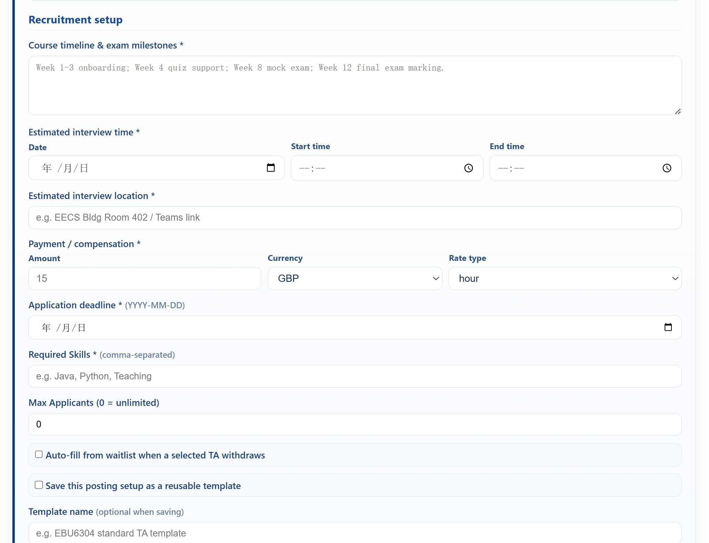

### 6.3 Job Templates

The Post Job page includes a reusable template area. An MO can load a saved template to prefill common posting information, then adjust details before submission.

### 6.4 My Jobs

The **My Jobs** page lets an MO manage one posting at a time. A posting can be opened into a focused workflow with tabs:

- Applicants
- Interview
- Waitlist
- Withdrawn
- Outcomes

The system keeps applicants separated by posting.
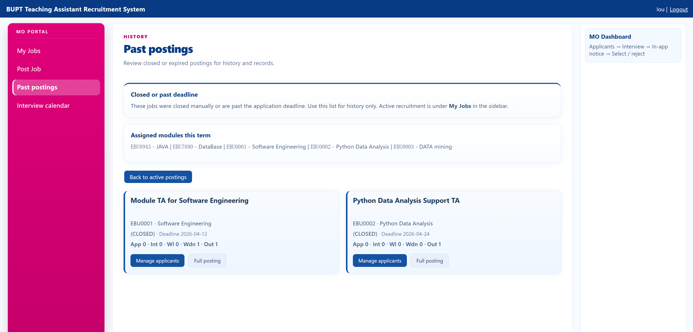

### 6.5 Applicants Tab

The Applicants tab shows pending applicants for a posting. Applicants are sorted using rule-based matching and workload signals.

MO actions:

- Review applicant summary and profile information.
- View or download CV when available.
- Generate an AI applicant summary if AI is configured.
- Move selected applicants to the interview stage.

### 6.6 Interview Tab

The Interview tab shows candidates in the interview stage.

The MO can send or update an in-app interview notice with:

- Interview date
- Interview time
- Location
- Assessment notes

The date and time fields are structured inputs, so free-text interview times are not accepted.

The MO can also review existing notices and continue candidate assessment.

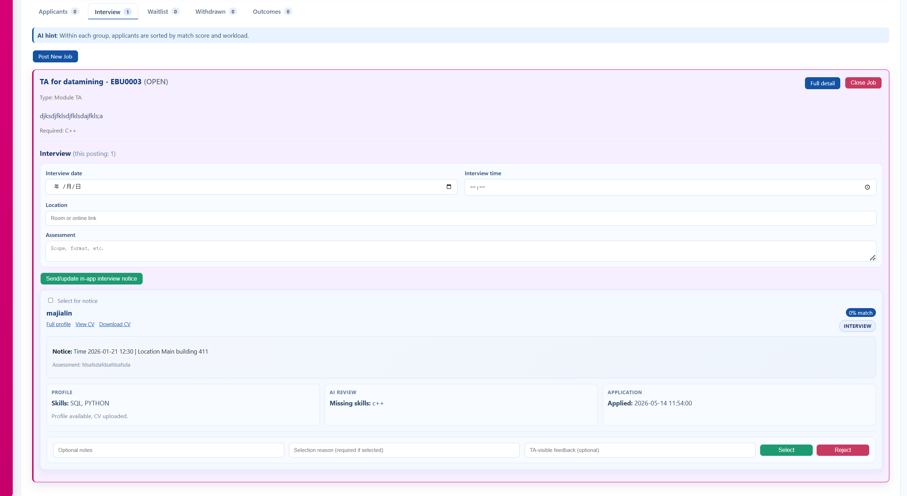

### 6.7 Interview Evaluation

Before selecting a candidate, the MO must save an interview evaluation. Evaluation fields include score categories and recommendation:

- Technical score
- Teaching score
- Communication score
- Availability score
- Responsibility score
- Recommendation
- Strengths
- Concerns
- Internal notes

Selection is blocked until an evaluation exists.


### 6.8 Waitlist and Outcomes

The Waitlist tab contains candidates placed on waitlist. The Outcomes tab contains selected, rejected, and other final-state applications.

Selection rules:

- Candidate must be in `INTERVIEW` or `WAITLIST`.
- Interview evaluation is required.
- Decision reason is required.
- Job capacity must have vacancy.
- Admin workload cap must not be exceeded.

If auto-fill from waitlist is enabled and a selected TA withdraws, the system can promote a waitlisted applicant.


### 6.9 Full Job Detail

The MO job detail page shows the full posting content and MO-only management areas. It includes:

- Published job information
- Work arrangements and planned recruits
- TA workload allocation
- Interview slot management
- Applicant-facing job preview

MOs can update work arrangements on active postings. Changes affect the published workload summary.

### 6.10 Interview Slots

MOs can create reusable interview slots for applicants to self-book. A slot includes:

- Start time
- End time
- Location
- Capacity
- Notes

Booked applicants are shown against each slot.


### 6.11 Interview Calendar

The MO interview calendar aggregates interview and waitlist applications across the MO's postings. It groups interviews by scheduled date and separates expired or unscheduled records.
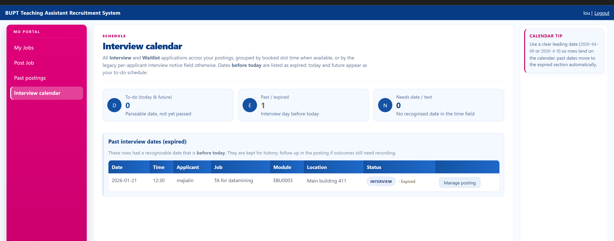


### 6.12 Past Postings

Past postings include closed jobs and jobs past their deadline. These are available for history and audit review. Management actions are disabled for inactive postings.
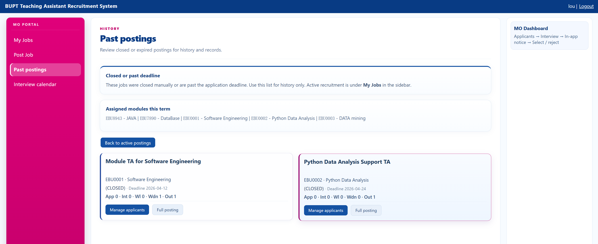

## 7. Admin Portal

The Admin sidebar includes:

- **Summary**
- **Workload**
- **Monitoring**
- **Email**
- **AI API**
- **Users**

### 7.1 Recruitment Summary

The Admin Summary page provides:

- Total jobs
- Open and inactive jobs
- Total applications
- Status breakdown
- User counts
- Current workload rule
- Auto-close status
- System pressure snapshot

Admin can configure workload limits:

- Maximum selected jobs per TA
- Maximum estimated workload hours per TA
- Auto-close pending applications when the limit is reached
  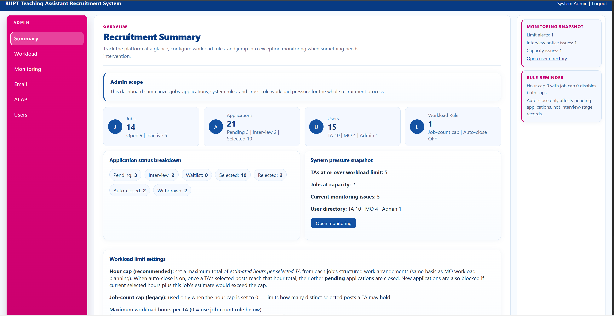

### 7.2 Workload

The Workload page shows selected-job distribution and estimated workload hours for TAs. It helps Admin identify overload and workload imbalance.

Admin can export workload information to CSV.
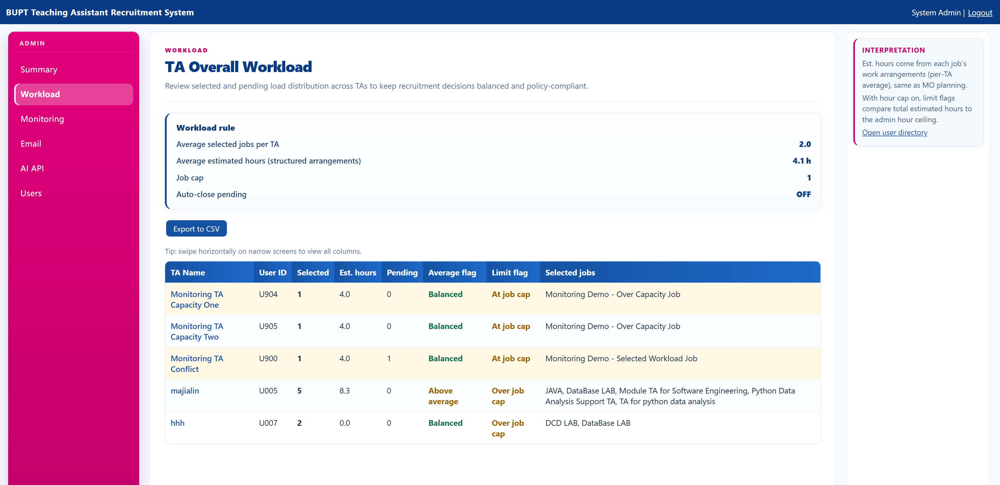

### 7.3 Monitoring

The Monitoring page highlights operational issues:

- Workload-limit conflicts
- Interview records missing notice details
- Active applications on inactive jobs
- Applications pointing to missing jobs
- Jobs over capacity
- Unread message reminder preview

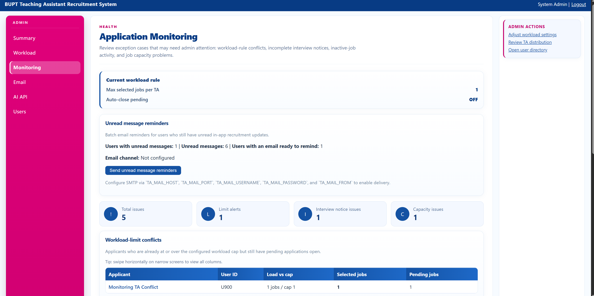

### 7.4 User Directory

The Users page lists all accounts and supports filtering by role. Admin can open detailed read-only records for TA and MO users.

User rows include role-specific activity summaries such as applications, selected counts, pending counts, interviews, posted jobs, and capacity risks.
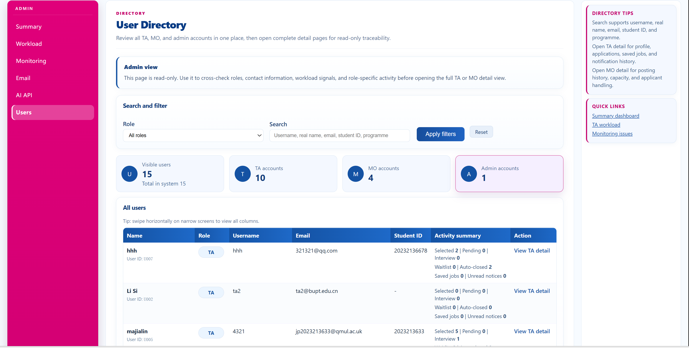

### 7.5 TA Detail

The TA detail page gives Admin a read-only view of a TA's profile, applications, workload, and related activity.
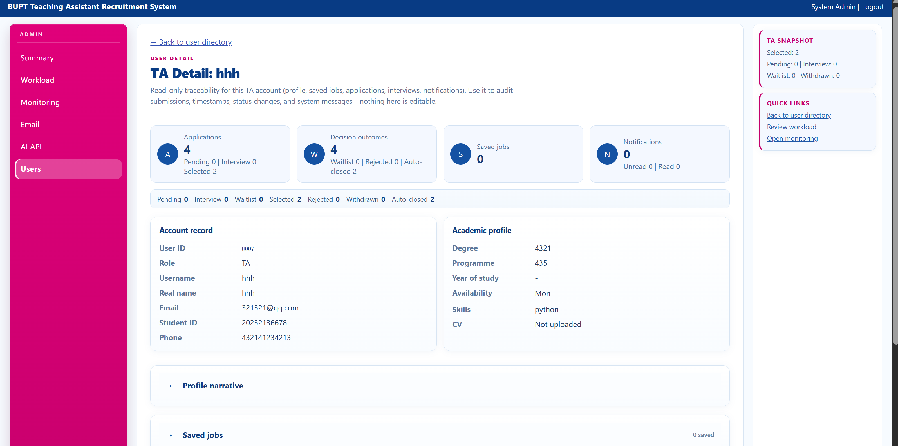

### 7.6 MO Detail and Module Assignment

The MO detail page provides posting history, application counts, workload risk signals, and all applications received by an MO.

Admin can edit **Assigned modules for this term**. The format is one module per line:

```text
MODULE_CODE | Module Name
```

Example:

```text
EBU6304 | Software Engineering
EBU6202 | Data Structures and Algorithms
```

After saving, the MO can only post jobs for these assigned module codes.

> **Screenshot placeholder: Admin MO Detail and Assigned Modules editor**

### 7.7 Email Settings

The Email settings page configures SMTP-based email delivery for:

- Email verification
- Password reset
- Optional notification reminders

If email is not configured, email-dependent features are disabled gracefully.
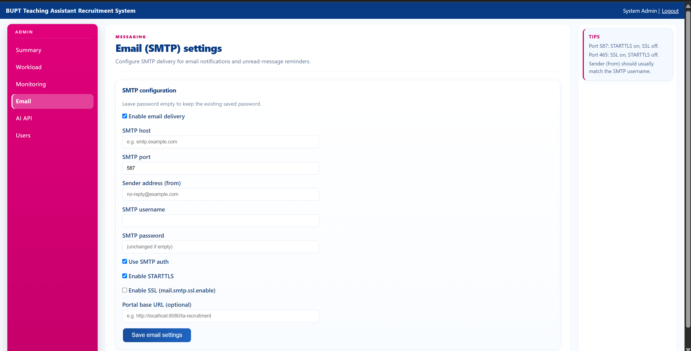

### 7.8 AI API Settings

The AI API settings page configures optional LLM functionality. It supports OpenAI-compatible endpoints such as MIMO, DeepSeek, OpenAI, Moonshot, or Ollama-compatible services.

Configurable fields:

- Enable LLM features
- Enable streaming responses
- Provider label
- API base URL
- Model name
- API key

Where AI is used:

- CV profile pre-fill
- TA job match insight
- MO applicant insight
- MO applicant summary cards

If no Admin AI key is saved, the system can fall back to environment variables such as `TA_AI_API_KEY`, `LLM_API_KEY`, `MIMO_API_KEY`, `OPENAI_API_KEY`, or `DEEPSEEK_API_KEY`.
Base URLs may be entered either as the provider root or with `/v1`; the application normalises them before calling `/v1/chat/completions`.

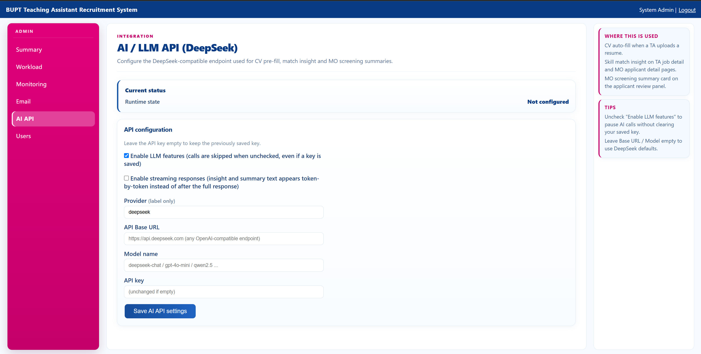

## 8. Application Status Lifecycle

Common application status flow:

```text
PENDING -> INTERVIEW -> WAITLIST -> SELECTED
                    \-> REJECTED
PENDING -> WITHDRAWN
PENDING -> AUTO_CLOSED
```

Notes:

- A TA submits an application as `PENDING`.
- An MO moves suitable applicants to `INTERVIEW`.
- An MO sends in-app interview notices.
- An MO saves interview evaluation records.
- An MO can select, reject, or waitlist candidates.
- Admin workload policies may block selection or auto-close pending applications.
- A TA may withdraw when allowed.

## 9. AI Features

AI features are optional. The system continues to operate if AI is not configured.

### 9.1 Rule-Based Matching

The system always supports deterministic matching based on job requirements and TA profile data. This produces match scores, matched skills, and missing skills.

### 9.2 LLM-Assisted Features

When configured, LLM features include:

- CV-based profile extraction
- TA-facing AI match insight
- MO-facing applicant insight
- MO applicant summary cards

Some responses can stream token-by-token when streaming is enabled in Admin settings.


## 10. Notifications

The system provides in-app notifications for key events:

- Application submitted
- Interview invitation
- Interview detail update
- Waitlist update
- Selection
- Rejection
- Auto-promotion or auto-close events

Email delivery is optional and depends on Admin SMTP configuration.
## 11. Data and Files

Runtime data is stored in JSON files under `data/`, including:

- `users.json`
- `profiles.json`
- `jobs.json`
- `applications.json`
- `settings.json`
- `mo-module-assignments.json`
- `ai-api-settings.json`
- `site-notifications.json`
- uploaded CV files under `data/uploads/`

The system is designed for the course project requirement of a Java Servlet/JSP application without a database.

## 12. Common Errors and Resolutions

| Message or Situation   | Meaning                                               | Resolution                                        |
| ---------------------- | ----------------------------------------------------- | ------------------------------------------------- |
| Login failed           | Username or password is incorrect                     | Check credentials or use demo accounts            |
| No modules assigned    | MO has no Admin-assigned modules                      | Admin must assign modules in MO detail            |
| Deadline must be valid | Application deadline is invalid or past               | Choose today or a future date                     |
| Workload cap exceeded  | TA would exceed Admin workload policy                 | Admin can adjust policy or TA can apply elsewhere |
| Evaluation required    | MO tried selecting before saving interview evaluation | Save evaluation first                             |
| Capacity reached       | Planned recruit slots are full                        | Increase planned recruits or reject/waitlist      |
| AI unavailable         | LLM API is not configured                             | Configure Admin AI API or environment variables   |
| Email disabled         | SMTP is not configured                                | Configure Admin Email settings                    |

